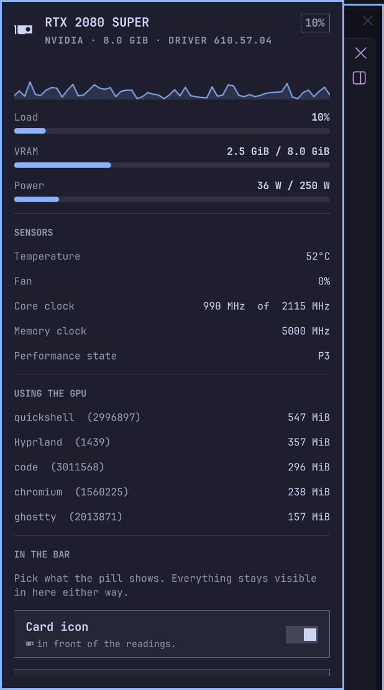

# GPU

Load, temperature, power and VRAM in the [Omarchy](https://omarchy.org/)
bar, and the full picture one click away.

The pill shows what you pick and recolours itself as the card gets busy.
The panel adds a load graph, VRAM and power meters, every sensor the driver
reports, and — on NVIDIA — the processes actually holding GPU memory.

NVIDIA is read through `nvidia-smi`; AMD and Intel through
`/sys/class/drm`. Anything a driver doesn't report is hidden rather than
guessed at. No daemon, no root, no network.

<!--  -->
<!--  -->

## Install

```bash
omarchy plugin add https://github.com/DanSmith888/omarchy-gpu.git --enable
```

### Check it

```bash
~/.config/omarchy/plugins/dansmith888.gpu/bin/gpuctl doctor
```

Verifies every link from the driver to the bar and tells you how to fix
whatever is broken.

## Update

```bash
omarchy plugin update dansmith888.gpu && omarchy restart shell
```

## Remove

```bash
omarchy plugin remove dansmith888.gpu
```

## Using it

**Left-click** the pill to open the panel. **Middle-click** opens `btop`,
reusing an existing btop window rather than stacking up terminals. **Hover**
for the card name and full readings. Esc closes. To open the panel from a
hotkey:

```bash
omarchy-shell shell toggle dansmith888.gpu
```

## What it shows

| Section | What's in it |
|---|---|
| **Hero** | Card name, vendor, VRAM size, driver version, current load |
| **Graph** | Recent load, 30–240 samples |
| **Load / VRAM / Power** | Utilisation, video memory in use, board power against its limit |
| **Sensors** | Temperature, fan, core and memory clocks, performance state |
| **Using the GPU** | Processes holding GPU memory, biggest first (NVIDIA only) |
| **In the bar** | Which readings the pill shows, card picker, refresh rate, °C/°F, graph history |
| **Warning & alert** | Two thresholds and a color each, taken from your live Omarchy theme; the pill and hero mark follow them |

Settings are stored inline on the widget's `~/.config/omarchy/shell.json`
entry and apply immediately.

## What each driver gives you

| | NVIDIA | AMD (amdgpu) | Intel (i915/xe) |
|---|---|---|---|
| Load | yes | yes | – |
| VRAM | yes | yes | – |
| Temperature | yes | yes | yes |
| Power | yes, with limit | yes | – |
| Clocks | core + memory | core | core |
| Fan | yes | yes (from PWM) | – |
| Processes | yes | – | – |

Rows with nothing behind them are hidden, so the panel only ever shows
readings that are real.

## Requirements

- Omarchy (Quattro or later)
- NVIDIA: `nvidia-utils` (for `nvidia-smi`)
- AMD / Intel: nothing — the kernel already exposes what's needed
- `pciutils` for the card's marketing name on AMD and Intel
- `btop`, only for the middle-click shortcut

## Command line

```
gpuctl get [--json] [-i N]   readings for one card
gpuctl list [--json]         every GPU discovered
gpuctl doctor                check every link from the driver to the bar
```

## Good to know

- On NVIDIA the process list merges compute clients with the graphics
  clients from `nvidia-smi -q -d PIDS`, so your compositor and browser show
  up, not just CUDA jobs.
- Multi-GPU machines get a card picker in the panel; the pill follows it.
- An idle card usually parks its clock and fan, so low numbers there are
  the card working correctly, not a bad reading.
- The pill reserves the width of its widest reading
  (`100% 100° 999W 99.9G`), so nothing in the bar shifts as digits come and
  go.
- The warning and alert thresholds were once called busy and hot; an
  existing bar entry keeps its old `busyFrom`/`hotColor` values.

## What runs, and as whom

Omarchy plugins run inside the shell process, unsandboxed, as your user.
This one runs two Python scripts from its own `bin/` — standard library
only, no extra packages, no network, nothing that needs root. It shells out
to `nvidia-smi` and `lspci` (both read-only) and writes nothing at all.

## Licence

MIT — see [LICENSE](LICENSE).
